# Val wiki

Bem-vindo ao Val Wiki, sua principal fonte de informações sobre o vasto universo de Valorant. Aqui, você terá acesso a conteúdos detalhados sobre agentes, armas, mapas, chaveiros, cards, skins e muito mais. Desenvolvemos este site com o objetivo de proporcionar a você um recurso abrangente e centralizado, oferecendo uma experiência imersiva ao explorar todos os aspectos de Valorant. Prepare-se para aprofundar seus conhecimentos e aprimorar suas habilidades no jogo.

## Layout Web

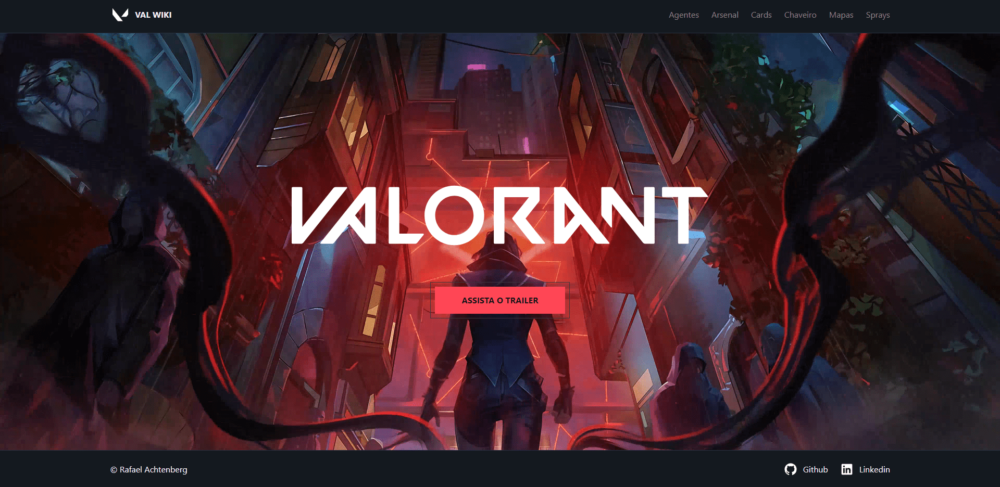
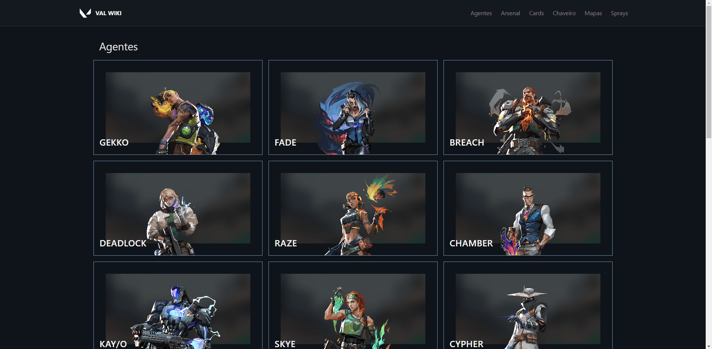
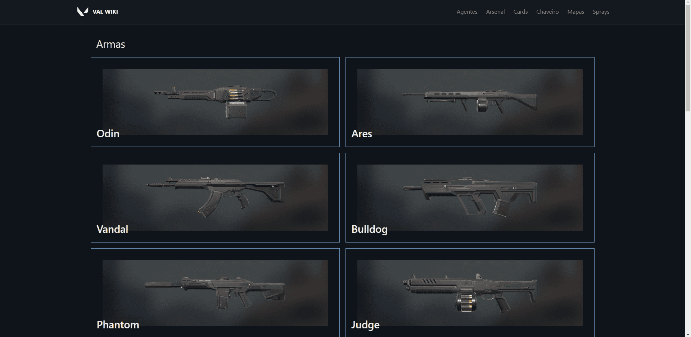
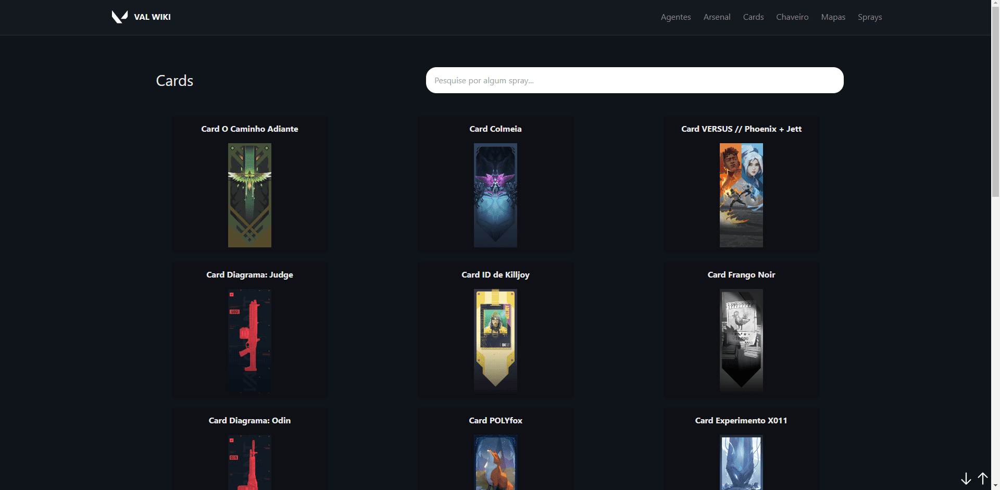
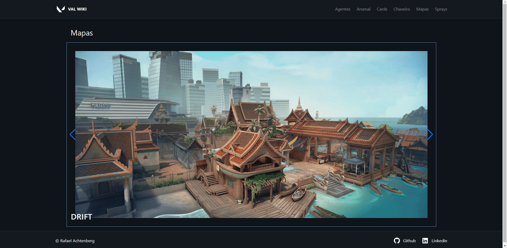

## Layout Mobile

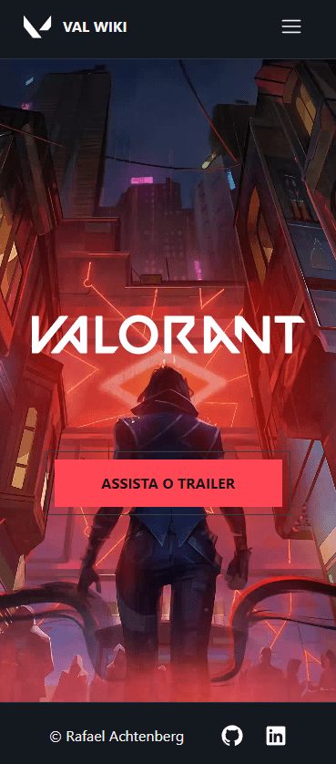

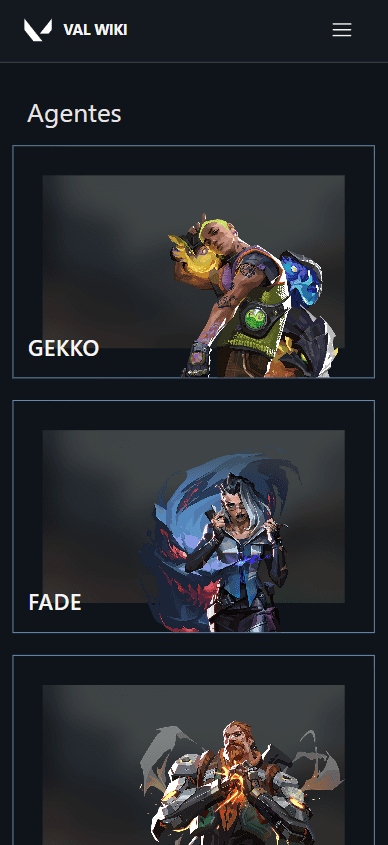

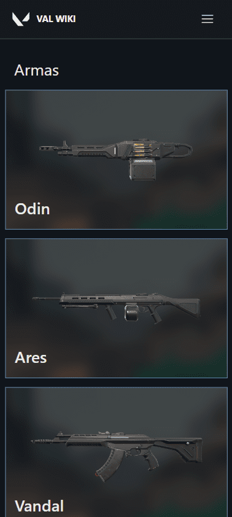

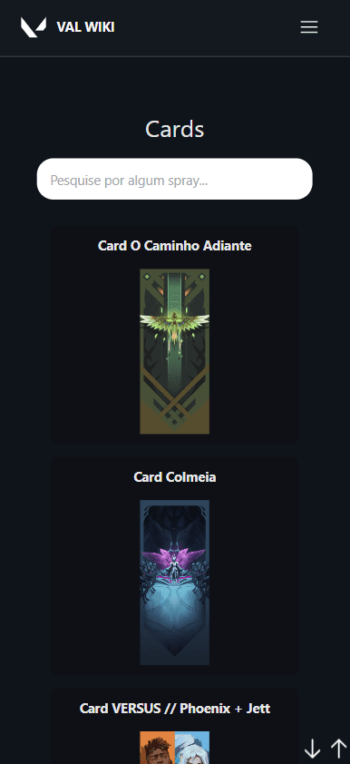

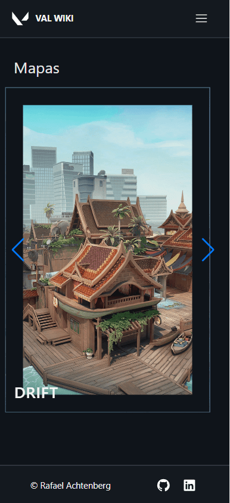

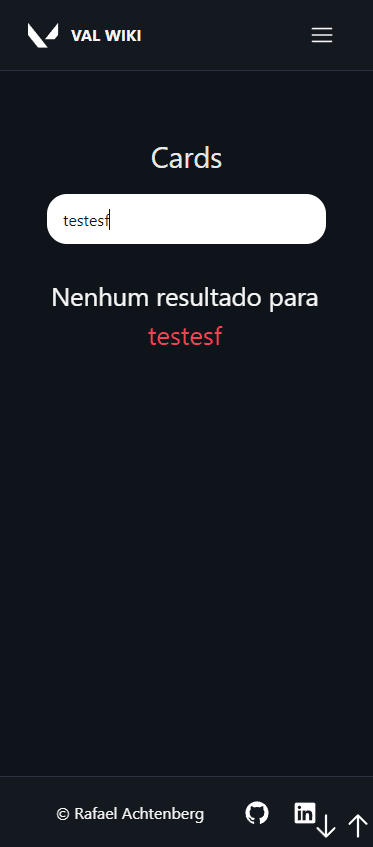

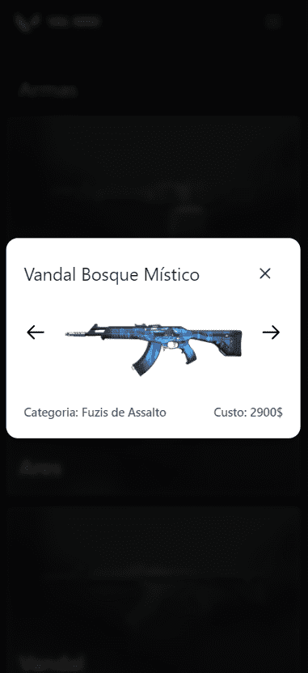

  <!-- Linha vazia para criar um espaçamento -->

## 🛠️ Tecnologias

💻 **Front-end**

- [React](https://react.dev/)
- [Typescript](https://www.typescriptlang.org)
- [Vite](https://vitejs.dev/)

📚 **Bibliotecas**

- [clsx](https://www.npmjs.com/package/clsx):
- [radix-ui](https://www.radix-ui.com/)
- [axios](https://zustand-demo.pmnd.rs/)
- [react-router-dom](https://reactrouter.com/en/main)
- [react-youtube](https://www.npmjs.com/package/react-youtube)
- [TanStack Query](https://tanstack.com/query/latest/docs/react/overview)
- [swiper](https://zod.dev/)
- [swiper](https://www.npmjs.com/package/tailwind-merge)

🎨 **Estilização**

- [tailwindcss](https://tailwindcss.com/docs/installation)

🔋 **Versionamento e Deploy**

- [Git](https://git-scm.com)

- [Vercel](https://vercel.com/)

⚙️ **Configuranções e Instalações**

Clone do Projeto

    $ git clone https://github.com/Faelkk/my-portfolio

Instalando as dependências

    $ npm install

Iniciando o projeto

    $ npm run dev

 

**Como me ajudar nesse projeto?**

- Você ira me ajudar muito me seguindo aqui no GitHub
- Dando uma estrela no projeto
- Conectando-se comigo no LinkedIn para fazer parte da minha rede.

 

**Feito por**
[Rafael Achtenberg](linkedin.com/in/rafael-achtenberg-7a4b12284/)
